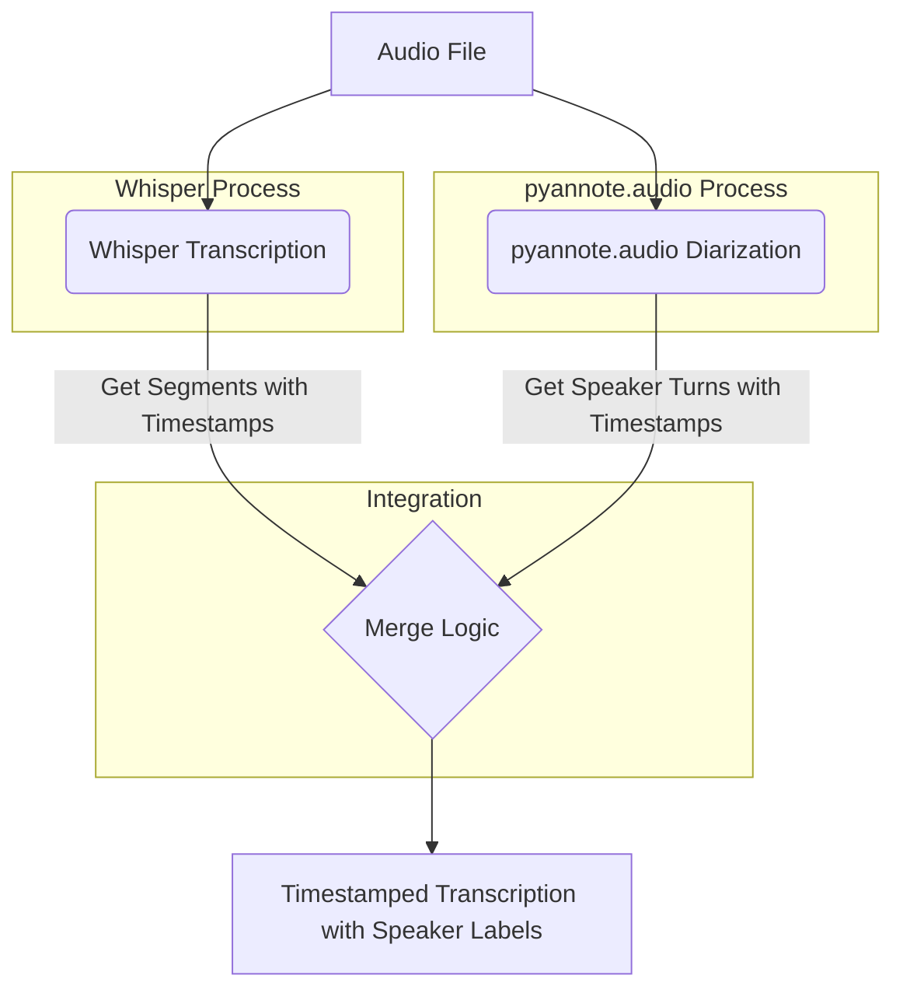

# Plan: Integrating Local Speaker Diarization with Whisper

## 1. Goal

To implement local speaker diarization and integrate it with the existing Whisper transcription functionality in [`app/transcriber.py`](app/transcriber.py). This will allow the system to identify and label different speakers in an audio file.

## 2. Chosen Speaker Diarization Tool

We will use **`pyannote.audio`**. It is a powerful open-source toolkit for speaker diarization, offering pre-trained models and pipelines that can be run locally. It's well-documented and widely used.

## 3. Enhancing Whisper Output

The current [`transcribe_audio`](app/transcriber.py:47) function in [`app/transcriber.py`](app/transcriber.py) returns only the full transcribed text. To integrate speaker labels, we need more granular information from Whisper.

*   **Action:** Modify the call to `_model.transcribe()` to retrieve segment-level or word-level timestamps along with the text. The `word_timestamps=True` parameter or accessing the `segments` key in the result object from Whisper can provide this.

    ```python
    # Example of getting segments from Whisper
    # result = _model.transcribe(audio_path, word_timestamps=True)
    # segments = result["segments"] 
    # or
    # result = _model.transcribe(audio_path)
    # segments = result["segments"] 
    # Each segment typically contains 'start', 'end', 'text', and potentially 'words' with their own timestamps.
    ```

## 4. Speaker Diarization with `pyannote.audio`

A separate step will be introduced to perform speaker diarization using `pyannote.audio`.

*   **Action:**
    1.  Add `pyannote.audio` to [`requirements.txt`](requirements.txt).
    2.  Implement a function that takes an audio file path as input.
    3.  Inside this function:
        *   Load a pre-trained speaker diarization pipeline from `pyannote.audio`. For example:
            ```python
            # from pyannote.audio import Pipeline
            # diarization_pipeline = Pipeline.from_pretrained("pyannote/speaker-diarization-pytorch")
            # For local execution without internet after first download, ensure models are cached.
            # Or, specify a local path to a downloaded model/pipeline.
            ```
        *   Process the audio file using this pipeline to obtain speaker segments. The output is typically a `pyannote.core.Annotation` object, which contains segments with speaker labels, start times, and end times.

            ```python
            # diarization_result = diarization_pipeline(audio_path)
            # for turn, _, speaker in diarization_result.itertracks(yield_label=True):
            #     print(f"Speaker {speaker} from {turn.start:.2f}s to {turn.end:.2f}s.")
            ```

## 5. Integration Strategy: Combining Whisper and Diarization Outputs

The core of the task is to map the speaker labels from `pyannote.audio` to the text segments from Whisper.

*   **Action:**
    1.  Develop a merging logic that takes Whisper's timestamped segments and `pyannote.audio`'s speaker turn information.
    2.  For each Whisper text segment (or word, depending on granularity):
        *   Determine its start and end time.
        *   Find which speaker was speaking during the majority of that segment's duration by comparing with `pyannote.audio`'s output. A common approach is to find the speaker whose turn has the maximum overlap with the Whisper segment.
    3.  Construct the final output. The format is flexible, but a good starting point could be a list of dictionaries, where each dictionary contains:
        *   `speaker_label` (e.g., "SPEAKER_00", "SPEAKER_01")
        *   `start_time`
        *   `end_time`
        *   `text_segment`

## 6. Proposed Code Structure Changes (in `app/transcriber.py`)

*   **Modify `transcribe_audio` or create a new function:**
    *   Consider renaming [`transcribe_audio`](app/transcriber.py:47) to something like `get_raw_transcription_segments` if it's only going to return Whisper's detailed output.
    *   Create a new primary function, e.g., `transcribe_and_diarize_audio(audio_path: str)`, which orchestrates calling Whisper, calling `pyannote.audio`, and then merging the results.
*   **New Helper Functions:**
    *   `diarize_audio_pyannote(audio_path: str)`: To encapsulate `pyannote.audio` logic.
    *   `merge_transcription_and_diarization(whisper_segments, diarization_turns)`: To implement the integration strategy.
*   **Model Loading:**
    *   The `pyannote.audio` pipeline should also be loaded and potentially cached, similar to how the Whisper model is handled in [`load_model()`](app/transcriber.py:14). This might involve creating a `load_diarization_pipeline()` function.
*   **Configuration:**
    *   Consider adding configuration options for `pyannote.audio` models/pipelines if needed (e.g., in global constants or environment variables).
*   **Update [`requirements.txt`](requirements.txt):**
    *   Add `pyannote.audio` and its dependencies (including a version of `torch` compatible with both Whisper and `pyannote.audio`).
    *   `pyannote.audio` often requires specific versions of `torch` and `torchaudio`. This needs careful management.

## 7. Data Flow Diagram (Mermaid)



## 8. Next Steps

Once this plan is approved:
1.  Write this plan to `SPEAKER_DIARIZATION_PLAN.md`.
2.  Switch to a suitable mode (e.g., "Code" mode) to implement the changes in [`app/transcriber.py`](app/transcriber.py) and update [`requirements.txt`](requirements.txt).

This plan provides a comprehensive approach to adding local speaker diarization capabilities.